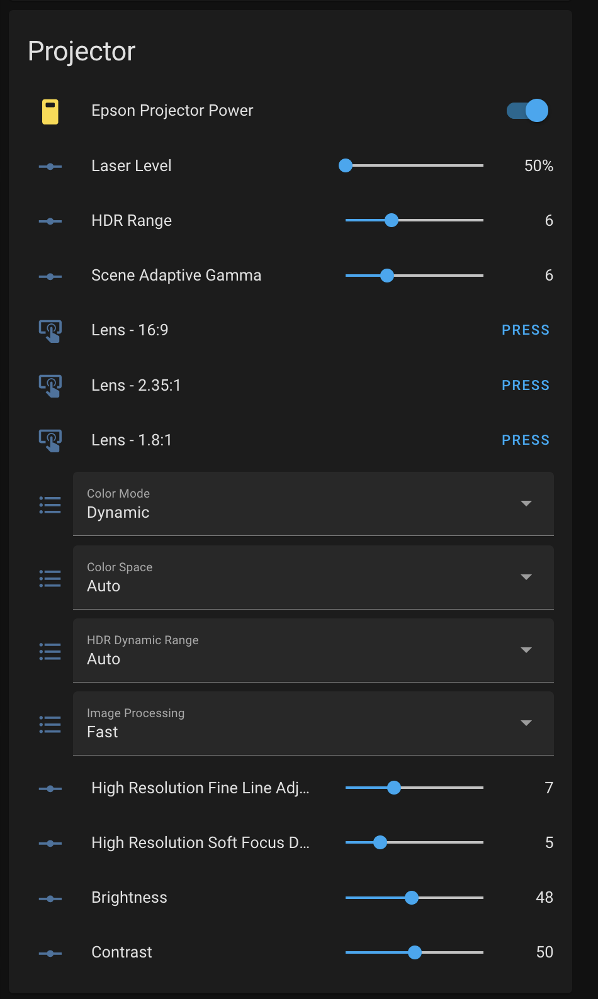
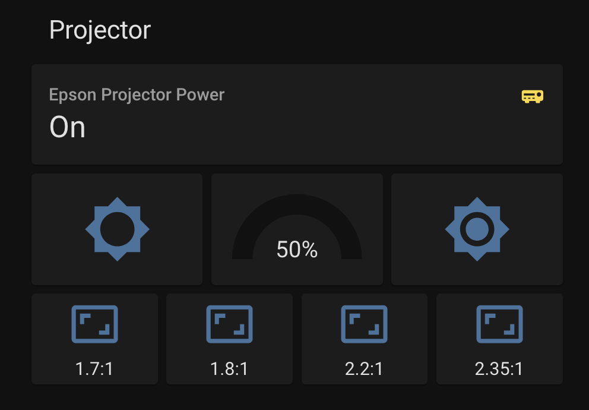

# Epson Projector (TCP) to MQTT Bridge

#### An Asynchronous Addon to control Epson projectors

This Addon creates a bridge between TCP-based EPSON projectors and MQTT.

Tested with the LS12000, but the LS11000 should work well too. May be usable with other EPSON projectors.

## Installation
### Pre-requisites

- MQTT Broker ([Mosquitto](https://github.com/home-assistant/addons/blob/master/mosquitto/DOCS.md) or a broker of your
  choice) already configured and running
- [MQTT Integration](https://www.home-assistant.io/integrations/mqtt/) in Home Assistant already configured
- TCP-capable EPSON Projector on your local network with a static IP address

### Installing the Addon

1. Add this repository to your Addon Store
2. Install the Addon
3. Configure on the `Configuration` tab, referring to the table below
4. Set the addon to `Start on boot`
5. Start the Addon

You should check the log to make sure that everything connected correctly. Once everything is right, you'll see new
entities (provided by the `MQTT` integration) appear in your Home Assistant `Entities` list.

For more information on the raw values returned by the projector, see
the [ESC/VP21 Command User's Guide](https://epson.com/Support/wa00572).

### Configuration Options

| Option Name                    | Required? | Default Value  | Purpose                                                                                   |
|--------------------------------|-----------|----------------|-------------------------------------------------------------------------------------------|
| MQTT Hostname or IP            | Required  |                | The hostname or IP of the MQTT broker to connect to                                       |
| Epson Projector Hostname or IP | Required  |                | The hostname or IP of the Epson projector to connect to                                   |
|                                |           |                |                                                                                           |
| MQTT Base Topic                | Optional  | `epson`        | Prefix used on the MQTT topic. Not visible in the UI.                                     |
| MQTT Username                  | Optional  |                | Required if your MQTT broker uses authentication                                          |
| MQTT Password                  | Optional  |                | Required if your MQTT broker uses authentication                                          |
|                                |           |                |                                                                                           |
| Epson Projector Name           | Optional  | Hostname or IP | A friendly name for the projector. Will be used in Home Assistant entity names.           |
|                                |           |                |                                                                                           |
| Reconnect Time                 | Optional  | `5`            | How often to try to connect to the MQTT broker or the projector if the connection is lost |
| Power Refresh Time             | Optional  | `5`            | How often to refresh the power status of the projector.                                   |
| Properties Refresh Time        | Optional  | `15`           | How often to refresh all the properties of the projector.                                 |
|                                |           |                |                                                                                           |
| Logging Level                  | Optional  | `info`         | How much logging to do. Options are `debug`, `info`, `warning`, `error`                   |

## Entities

These entities will be created automatically in Home Assistant by
the [MQTT Integration](https://www.home-assistant.io/integrations/mqtt/).

### Power Status

| Entity Name           | Entity ID                    | Read/Write? | Purpose                                                                              |
|-----------------------|------------------------------|-------------|--------------------------------------------------------------------------------------|
| Epson Projector Power | select.epson_power_read_only | Read/Write  | Power on/off the projector.                                                          |
| Power (Read Only)     | select.epson_power_read_only | Read Only   | Gives more details about the power status of the projector (Warm Up, Cool Down, etc) |

### Video Input

| Entity Name        | Entity ID           | Read/Write? | Purpose                             |
|--------------------|---------------------|-------------|-------------------------------------|
| Source             | select.epson_source | Read/Write  | Selects the input source            |
| Signal             | select.epson_signal | Read Only   | Signal status of the current source |
| Video Mute / Blank | select.epson_mute   | Read/Write  | Mute (blank) the image              |

### Lens and Lamp

For information on value ranges, see the [ESC/VP21 Command User's Guide](https://epson.com/Support/wa00572).

| Entity Name           | Entity ID                   | Read/Write? | Purpose                                             |
|-----------------------|-----------------------------|-------------|-----------------------------------------------------|
| Lens Vertical Shift   | sensor.epson_lens           | Read Only   |                                                     |
| Lens Horizontal Shift | sensor.epson_hlens          | Read Only   |                                                     |
| Lens Zoom             | sensor.epson_zoom           | Read Only   |                                                     |
| Lens Focus            | sensor.epson_focus          | Read Only   |                                                     |
|                       |                             |             |                                                     |
| Lamp Level            | number.epson_lamp_level     | Read/Write  | The lamp level (brightness) output of the projector |
| Lamp Hours            | sensor.epson_lamp           | Read Only   |                                                     |
|                       |                             |             |                                                     |
| Load Lens Memory #    | button.epson_lens_memory_XX | Write Only  | Load a lens memory                                  |

### Image Settings

| Entity Name                          | Entity ID                                         | Read/Write? | Notes                                                                                                     |
|--------------------------------------|---------------------------------------------------|-------------|-----------------------------------------------------------------------------------------------------------|
| Brightness                           | number.epson_brightness                           | Read/Write  | Image brightness, not projector lamp brightness                                                           |
| Contrast                             | number.epson_contrast                             | Read/Write  |                                                                                                           |
| Saturation                           | number.epson_density                              | Read/Write  |                                                                                                           |
| Tint                                 | number.epson_tint                                 | Read/Write  |                                                                                                           |
|                                      |                                                   |             |                                                                                                           |
| Color Mode                           | select.epson_cmode                                | Read/Write  | Dynamic, Vivid, etc                                                                                       |
| Color Space                          | select.epson_color_space                          | Read/Write  | Auto, BT.709, BT.2020                                                                                     |
| HDR Dynamic Range                    | select.epson_hdr_dynamic_range                    | Read/Write  | Auto, SDR, HDR                                                                                            |
| HDR Range                            | number.epson_hdr_range                            | Read/Write  | The HDR Slider value 1-17                                                                                 |
|                                      |                                                   |             |                                                                                                           |
| Gamma                                | select.epson_gamma                                | Read/Write  | -2, -1, +0, +1, +2, Custom                                                                                |
| Scene Adaptive Gamma                 | number.epson_scene_adaptive_gamma                 | Read/Write  |                                                                                                           |
|                                      |                                                   |             |                                                                                                           |
| High Resolution Fine Line Adjustment | number.epson_high_resolution_fine_line_adjustment | Read/Write  |                                                                                                           |
| High Resolution Soft Focus Detail    | number.epson_high_resolution_soft_focus_detail    | Read/Write  |                                                                                                           |
| Image Processing                     | select.epson_imgproc                              | Read/Write  | Fine, Fast                                                                                                |
| Aspect Ratio                         | select.epson_aspect                               | Read/Write  |                                                                                                           |
|                                      |                                                   |             |                                                                                                           |
| RGB Gain                             | number.epson_gain(r/g/b)                          | Read/Write  |                                                                                                           |
| RGB Offset                           | number.epson_offset(r/g/b)                        | Read/Write  |                                                                                                           |
| RGB CMY                              | text.epson_rgbcmy                                 | Read Only   | RGB and CMY adjustment values.<br>See [ESC/VP21 Command User's Guide](https://epson.com/Support/wa00572). |
|                                      |                                                   |             |                                                                                                           |
| Load Image Memory #                  | button.epson_image_memory_XX                      | Write Only  | Load an image memory                                                                                      |

### Image Correction

| Entity Name         | Entity ID                | Read/Write? | Notes                                    |
|---------------------|--------------------------|-------------|------------------------------------------|
| Correction Method   | select.epson_correctmet  | Read/Write  | Keystone, Quick Corner, Point Correction |
|                     |                          |             |                                          |
| Horizontal Keystone | number.epson_keystone    | Read/Write  |                                          |
| Vertical Keystone   | number.epson_vkeystone   | Read/Write  |                                          |
|                     |                          |             |                                          |
| Quick Corners       | text.epson_quick_corners | Read/Write  | ULx, ULy, URx, URy, LRx, LRy, LLx, LLy   |

### Special Commands

#### Projector Busy

| Entity Name    | Entity ID                | Read/Write? |
|----------------|--------------------------|-------------|
| Projector Busy | binary_sensor.epson_busy | Read Only   |

Set to `ON` when the projector is busy processing a previous command. You may monitor this entity to determine when a
command has finished executing.

Useful for commands that take a while, like lens memory loads.

#### Refresh All Properties

| Entity Name | Entity ID                           | Read/Write? |
|-------------|-------------------------------------|-------------|
| Refresh All | button.epson_refresh_all_properties | Write Only  |

Activating this button will cause the addon to immediately start updating all the projector's properties.

Useful for when you want to make sure you have the latest values before you make a decision.

`Projector Busy` is set to `ON` while this command is running, so you can monitor that entity to determine when the
property refresh is done.

#### Send Remote Key

| Entity Name     | Entity ID                  | Read/Write? |
|-----------------|----------------------------|-------------|
| Send Remote Key | text.epson_send_remote_key | Write Only  |

Updating this entity with a remote key will cause the addon to send that key to the projector.

For a list of possible remote key codes, see the [ESC/VP21 Command User's Guide](https://epson.com/Support/wa00572).

#### Send Command

| Entity Name  | Entity ID               | Read/Write? |
|--------------|-------------------------|-------------|
| Send Command | text.epson_send_command | Read/Write  |

Updating this entry with an ESC/VP21 command will cause the addon to send that command to the projector. The text value
will then be updated with the response from the projector, allowing for a psuedo-two-way communication service.

You can use this to use features that aren't otherwise supported by this addon. Use this as a last resort.

It is safe to send multiple commands from parallel processes, but probably not safe to read the response from multiple
commands at once. YMMV.

For a list of possible commands, see the [ESC/VP21 Command User's Guide](https://epson.com/Support/wa00572).

## Home Assistant UI



```yaml

type: entities
entities:
  - entity: switch.epson
  - entity: number.epson_projector_lamp_level
  - entity: number.epson_projector_hdr_range
  - entity: number.epson_projector_scene_adaptive_gamma
  - entity: button.epson_projector_load_lens_memory_1
  - entity: button.epson_projector_load_lens_memory_2
  - entity: button.epson_projector_load_lens_memory_3
  - entity: select.epson_projector_color_mode
  - entity: select.epson_projector_color_space
  - entity: select.epson_projector_hdr_dynamic_range
  - entity: select.epson_projector_image_processing
  - entity: number.epson_projector_high_resolution_fine_line_adjustment
  - entity: number.epson_projector_high_resolution_soft_focus_detail
  - entity: number.epson_projector_brightness
  - entity: number.epson_projector_contrast
title: Projector
state_color: true
```

This config is a bit more complex, but makes things a little more touch friendly for a phone.



```yaml
- type: vertical-stack
    title: Projector
    cards:
      - type: entity
        entity: switch.epson
        icon: mdi:audio-video
        state_color: true
      - type: conditional
        conditions:
          - entity: switch.epson
            state: 'on'
        card:
          type: vertical-stack
          cards:
            - type: horizontal-stack
              cards:
                - show_name: false
                  show_icon: true
                  type: button
                  tap_action:
                    action: call-service
                    service: script.epson_lamp_decrease
                    service_data: { }
                    target: { }
                  entity: script.epson_lamp_decrease
                  hold_action:
                    action: none
                  show_state: false
                - type: gauge
                  entity: number.epson_projector_lamp_level
                  name: ' '
                  max: 100
                  min: 50
                  needle: false
                - show_name: false
                  show_icon: true
                  type: button
                  tap_action:
                    action: call-service
                    service: script.epson_lamp_increase
                    service_data: { }
                    target: { }
                  entity: script.epson_lamp_increase
            - type: horizontal-stack
              cards:
                - show_name: true
                  show_icon: true
                  type: button
                  entity: button.epson_projector_load_lens_memory_1
                  name: 1.7:1
                  icon: mdi:aspect-ratio
                  tap_action:
                    action: toggle
                - show_name: true
                  show_icon: true
                  type: button
                  entity: button.epson_projector_load_lens_memory_3
                  name: 1.8:1
                  icon: mdi:aspect-ratio
                  tap_action:
                    action: toggle
                - show_name: true
                  show_icon: true
                  type: button
                  entity: button.epson_projector_load_lens_memory_4
                  name: 2.2:1
                  icon: mdi:aspect-ratio
                  tap_action:
                    action: toggle
                - show_name: true
                  show_icon: true
                  type: button
                  entity: button.epson_projector_load_lens_memory_2
                  name: 2.35:1
                  icon: mdi:aspect-ratio
                  tap_action:
                    action: toggle
```

## References

- [ESC/VP21 Command User's Guide](https://epson.com/Support/wa00572) - all commands being sent are in the guide,
  including expected values for each command.