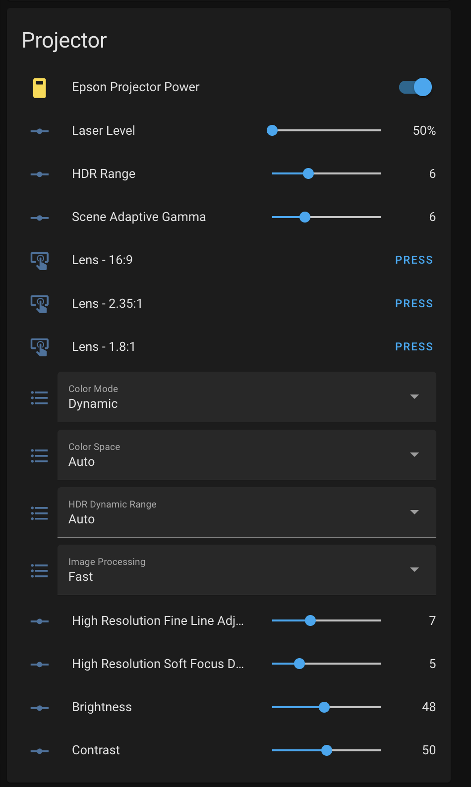
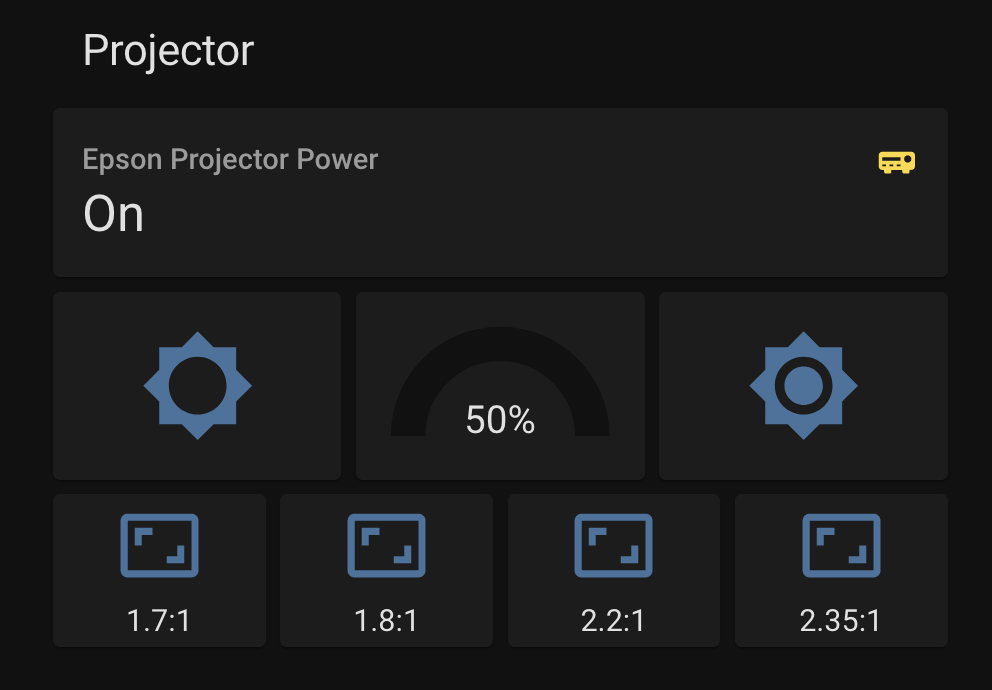

# Epson-projector module
## Asynchronous library to control epson projectors

Requires Python 3.5. asyncio, aiohttp.

Created mostly to use with Home Assistant, specifically with the Epson LS12000. The LS11000 should work as well.

### Deploying with Docker

Build locally, then deploy with two environment variables: 

* `MQTT_HOST` -- IP address of your MQTT broker
* `EPSON_IP` -- IP address of your Epson projector, I'd recommend setting a static IP on your projector first.

I use this bash script locally when pulling a new version to update + restart.

```bash
#! /bin/bash

docker stop epson_bridge
docker rm epson_bridge
docker rmi epson_bridge
docker build -t epson_bridge .
docker run -d --restart always --name epson_bridge --env MQTT_HOST=192.168.1.98 --env EPSON_IP=192.168.1.30 epson_bridge
```

### Running manually

Run `python /usr/src/app/asyncio_mqtt_based_client.py`

### Configuring in Home Assistant

You'll need an MQTT broker first, so setup that integration if you haven't already.

Once this server starts it will publish to the `homeassistant` topic a list of capabilities, and Home Assistant should automatically pick this up on your Entities list. If the projector is not on the entities will show up as unavailable. These automatically become available when the projector powers on and latches onto a video signal correctly.

From there you can add things as needed to your HA UI. I have two places where I use it.



```yaml

type: entities
entities:
  - entity: switch.epson
  - entity: number.epson_projector_laser_level
  - entity: number.epson_projector_hdr_range
  - entity: number.epson_projector_scene_adaptive_gamma
  - entity: button.epson_projector_load_lens_memory_1
  - entity: button.epson_projector_load_lens_memory_2
  - entity: button.epson_projector_load_lens_memory_3
  - entity: select.epson_projector_color_mode
  - entity: select.epson_projector_color_space
  - entity: select.epson_projector_hdr_dynamic_range
  - entity: select.epson_projector_image_processing
  - entity: number.epson_projector_high_resolution_fine_line_adjustment
  - entity: number.epson_projector_high_resolution_soft_focus_detail
  - entity: number.epson_projector_brightness
  - entity: number.epson_projector_contrast
title: Projector
state_color: true
```

This config is a bit more complex, but makes things a little more touch friendly for a phone.



```yaml
- type: vertical-stack
    title: Projector
    cards:
      - type: entity
        entity: switch.epson
        icon: mdi:audio-video
        state_color: true
      - type: conditional
        conditions:
          - entity: switch.epson
            state: 'on'
        card:
          type: vertical-stack
          cards:
            - type: horizontal-stack
              cards:
                - show_name: false
                  show_icon: true
                  type: button
                  tap_action:
                    action: call-service
                    service: script.epson_laser_decrease
                    service_data: {}
                    target: {}
                  entity: script.epson_laser_decrease
                  hold_action:
                    action: none
                  show_state: false
                - type: gauge
                  entity: number.epson_projector_laser_level
                  name: ' '
                  max: 100
                  min: 50
                  needle: false
                - show_name: false
                  show_icon: true
                  type: button
                  tap_action:
                    action: call-service
                    service: script.epson_laser_increase
                    service_data: {}
                    target: {}
                  entity: script.epson_laser_increase
            - type: horizontal-stack
              cards:
                - show_name: true
                  show_icon: true
                  type: button
                  entity: button.epson_projector_load_lens_memory_1
                  name: 1.7:1
                  icon: mdi:aspect-ratio
                  tap_action:
                    action: toggle
                - show_name: true
                  show_icon: true
                  type: button
                  entity: button.epson_projector_load_lens_memory_3
                  name: 1.8:1
                  icon: mdi:aspect-ratio
                  tap_action:
                    action: toggle
                - show_name: true
                  show_icon: true
                  type: button
                  entity: button.epson_projector_load_lens_memory_4
                  name: 2.2:1
                  icon: mdi:aspect-ratio
                  tap_action:
                    action: toggle
                - show_name: true
                  show_icon: true
                  type: button
                  entity: button.epson_projector_load_lens_memory_2
                  name: 2.35:1
                  icon: mdi:aspect-ratio
                  tap_action:
                    action: toggle
```
